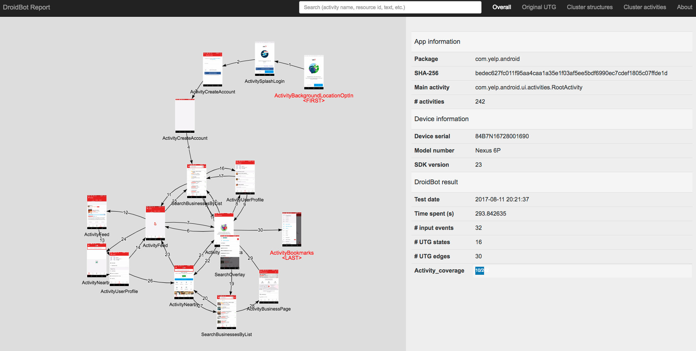

# DroidBot

## About
DroidBot is a lightweight test input generator for Android.
It can send random or scripted input events to an Android app, achieve higher test coverage more quickly, and generate a UI transition graph (UTG) after testing.

A sample UTG is shown [here](http://honeynet.github.io/droidbot/report_com.yelp.android/).

DroidBot has the following advantages as compared with other input generators:

1. It does not require system modification or app instrumentation;
2. Events are based on a GUI model (instead of random);
3. It is programmable (can customize input for certain UI);
4. It can produce UI structures and method traces for analysis.

**Reference**

[Li, Yuanchun, et al. "DroidBot: a lightweight UI-guided test input generator for Android." In Proceedings of the 39th International Conference on Software Engineering Companion (ICSE-C '17). Buenos Aires, Argentina, 2017.](http://dl.acm.org/citation.cfm?id=3098352)

## Prerequisite

1. `Python` version `2.7`
2. `Java` version `1.7`
3. `Android SDK`
4. Add `platform_tools` directory and `tools` directory in Android SDK to `PATH`

## How to install

Clone this repo and intall with `pip`:

```shell
git clone https://github.com/honeynet/droidbot.git
pip install -e droidbot
```

If successfully installed, you should be able to execute `droidbot -h`.

## How to use

1. Make sure you have:

    + `.apk` file path of the app you want to analyze.
    + A device or an emulator connected to your host machine via `adb`.
    + Get the serial number (e.g. `emulator-5554`) of target device using `adb devices`.

2. Start DroidBot:

    ```
    droidbot -d <serial> -a <path_to_apk> -policy dfs
    ```

## Test strategy

DroidBot uses an app model to generate test input.
Currently, DroidBot support following three strategies:

1. **random** -- Generate random input events;
2. **dfs**/**bfs** -- Explore the UI states using a depth-first/breadth-first strategy;
3. **script** -- Use a script to customize input for certain states. [HOW](http://honeynet.github.io/droidbot/2016/08/19/DroidBot_Script.html).

## Evaluation

We have conducted several experiments to evaluate DroidBot by testing apps with DroidBot and Monkey.
The results can be found at [DroidBot Posts](http://honeynet.github.io/droidbot/).
A sample evaluation report can be found [here](http://honeynet.github.io/droidbot/2015/07/30/Evaluation_Report_2015-07-30_1501.html).

## Acknowledgement

1. [AndroidViewClient](https://github.com/dtmilano/AndroidViewClient)
2. [Androguard](http://code.google.com/p/androguard/)
3. [The Honeynet project](https://www.honeynet.org/)
4. [Google Summer of Code](https://summerofcode.withgoogle.com/)

## Useful links

- [DroidBot Blog Posts](http://honeynet.github.io/droidbot/)
- [How to contact the author](http://ylimit.github.io)
